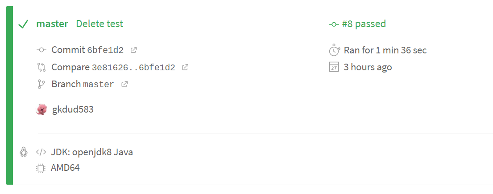
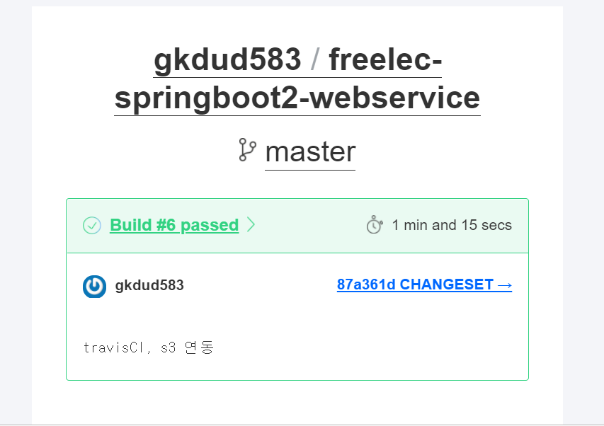
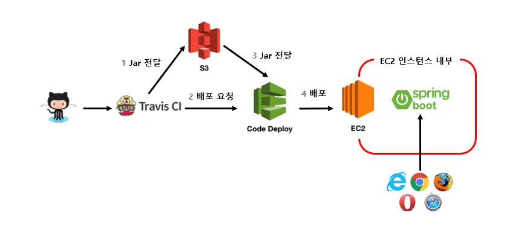
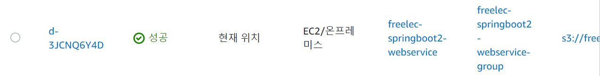
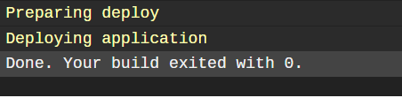
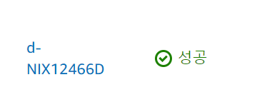

# Travis CI 배포 자동화📌

## CI, CD란?
* CI(Continus Integration - 지속적 통합):
VCS시스템(Git, SVN 등)에 PUSH가 되면 자동으로 테스트와 빌드가 수행되어 안정적인 배포
  파일을 만드는 과정.  
  지속적으로 통합하기 위해서는 무엇보다 프로젝트가 완전한 상태임을 보장하기 위해 테스트 코드가
  구현되어 있어야만 한다.  
* CD(Continus Deployment - 지속적인 배포):
이 빌드 결과를 자동으로 운영 서버에 무중단 배포까지 진행되는 과정.  
  
## CI,CD가 왜 필요한가?
24시간 265일 운영되는 서비스에서 배포 환경 구축은 필수 과제 중 하나이다.  
이전 장에서 deploy.sh 라는 쉘 스크립트를 만들어 EC2에 배포하는것을 해 보았는데,
그렇게 할 경우 수동 테스트, 수동 빌드가 꽤나 번거롭다.  
왜냐하면 현대의 웹 서비스 개발에서는 하나의 프로젝트를 여러 개발자가 함께 진행하기 때문에 
각자가 개발한 코드를 합칠때마다 큰 일 이기 때문.  
그래서 개발자 각자가 원격 저장소(깃허브나 깃랩 등)로 푸시를 할때마다 코드를 병합하고,
테스트 코드와 빌드를 수행하면서 자동으로 코드가 통합되어 더는 수동으로 코드를 통합할
필요가 없어지면서 개발자들 역시 개발에만 집중할수 있게 되었다.  

CD역시 한 두대의 서버만 있다면 개발자가 수동으로 배포할수 있지만 수십대 수백대의 서버에 배포를
해야하거나 긴박하게 배포를 해야하는 상황이오면 더 이상 수동으로 배포할수가 없다.

## Travis CI 연동하기
Travis CI는 깃허브에서 제공하는 무료 CI 서비스이다. 젠킨스와 같은 CI도구도 있지만
젠킨스는 EC2인스턴스가 하나 더 필요하기 때문에 Travis CI를 사용한다.

Travis CI 홈페이지에서 깃허브 계정으로 로그인 후 CI가 필요한 리포지토리를 연동하면 된다.

## 프로젝트 설정
Travis CI의 상세한 설정은 프로젝트에 존재하는 .travis.yml 파일로 할수있다.
```yml
language: java
jdk:
  - openjdk8

branches: #Travis CI가 어느 브랜치가 PUSH될때 수행될지 결정
  only:
    - master

# Travis CI 서버의 Home
cache: #그레이들을 통해 의존성을 받게 되면 이를 해당 디렉토리에 캐시하여, 같은 의존성은 다음 배포 때 부터 다시 받지 않도록 설정  
  directories:
    - '$HOME/.m2/repository'
    - '$HOME/.gradle'


before_install: #gradle 실행 권한이 없으면 Travis CI가 빌드할때 에러가 나기때문에 추가
  - chmod +x gradlew

script: "./gradlew clean build" #master 브랜치에 푸시됐을때 수행하는 명령어. 프로젝트 내부에 둔 gradlew를 통해 clean & build를 수행


# CI 실행 완료시 메일로 알람
notifications:
  email:
    recipients:
      - 메일
```

master 브랜치에 커밋과 푸시를 하고, Travis CI저장소 페이지를 확인하면
빌드가 성공했다는것이 확인되고 받은 이메일도 확인된다.

같은 빌드 성공시 캡쳐는 아니지만 이런식으로 된다는것만 확인!




## Travis CI와 AWS s3 연동
s3는 AWS에서 제공하는 일종의 파일서버인데, 정적 파일들을 관리하거나 지금 진행하는 것처럼
배포 파일들을 관리 하는등의 기능을 지원한다.
S3을 비롯한 AWS서비스와 Travis CI를 연동하게 되면 전체구조는 다음과 같다.

  
https://slo-ow.github.io/spring/spring-freelec-springboot-chap9/

실제 배포를 하는 codeDeploy라는 서비스도 빌드기능이 있는데 굳이 
S3를 연동하는 이유는 codeDeploy는 저장 기능이 없기 떄문에 빌드 없이 배포만
할때 대응하기가 어렵다.   
빌드와 배포가 분리되어 있다면 예전에 빌드되어 만들어진
jar를 재사용하면 되지만 codeDeploy는 항상 빌드를 하게 되니 확장성이 떨어진다. 그래서 빌드와 배포를 분리한다.

* ### Travis CI와 S3, CodeDeploy 연동
AWS 서비스에 외부 서비스가 접근할 수 없기 때문에 Travis CI가 S3에 접근할수 있도록
AWS Key를 발급해서 사용해야한다. 이러한 서비스를 제공하는것이 AWS의 IAM서비스이다.

* ### IAM에서 사용자 추가 (생략)
* ### 생성된 엑세스 키와 비밀 엑세스 키를 Travis CI에 등록 (생략)

* ### S3 버킷 생성 (생략)
* ### Travis CI에서 빌드하여 만든 Jar파일을 S3에 올릴 수 있도록 .travis.yml수정
```yml
language: java
jdk:
  - openjdk8

branches:
  only:
    - master

# Travis CI 서버의 Home
cache:
  directories:
    - '$HOME/.m2/repository'
    - '$HOME/.gradle'


before_install:
  - chmod +x gradlew

script: "./gradlew clean build"


before_deploy: #deploy명령어가 실행되기 전에 수행
  - zip -r freelec-springboot2-webservice * #codeDeploy는 jar파일은 인식하지 못하기 때문에 jar+기타 설정 파일들을 모아 압축
  - mkdir -p deploy # zip에 포함시킬 파일들을 담을 디렉토리 생성
  - mv freelec-springboot2-webservice.zip deploy/freelec-springboot2-webservice.zip

deploy: #S3로 파일 업로드 혹은 CodeDeploy로 배포 등 외부 서비스와 연동 될 행위들을 선언
  - provider: s3
    access_key_id: $AWS_ACCESS_KEY # Travis repo settings에 설정된 값
    secret_access_key: $AWS_SECRET_KEY # Travis repo settings에 설정된 값
    bucket: freelec-springboot-build4860 # S3 버킷
    region: ap-northeast-2
    skip_cleanup: true
    acl: private # zip 파일 접근을 private으로
    local_dir: deploy # before_deploy에서 생성한 디렉토리, 해당 위치의 파일들만 S3로 전송
    wait-until-deployed: true


# CI 실행 완료시 메일로 알람
notifications:
  email:
    recipients:
      - 이메일
```
    
깃허브로 푸시하면 Travis CI에서 자동으로 빌드되고 S3버킷을 가보면 업로드가 성공한것을 볼수 있다.


## AWS의 배포 시스템인 CodeDeploy를 이용하기 전에 배포 대상인 EC2가 CodeDeploy를 연동 받을 수 있게 IAM 역할 생성

사용자는 AWS 서비스에만 할당할 수 있는 권한이고, 사용자는 AWS 서비스 외에 사용할 수 있는 권한이다.

* ### EC2에 IAM 역할 추가(생략)
* ### CodeDeploy의 요청을 받을 수 있게 에이전트 설치(생략)
* ### CodeDeploy를 위한 권한 생성(생략)
* ### CodeDeploy 생성(생략)
* ### Travis CI, S3, CodeDeploy 연동
1. S3에서 넘겨줄 ZIP파일을 저장할 디렉토리 생성
```
mkdir ~/app/step2 && mkdir ~/app/step2/zip
```
2. Travis CI 설정(.travis.yml)
```yml
language: java
jdk:
  - openjdk8

branches:
  only:
    - master

# Travis CI 서버의 Home
cache:
  directories:
    - '$HOME/.m2/repository'
    - '$HOME/.gradle'


before_install:
  - chmod +x gradlew

script: "./gradlew clean build"


before_deploy:
  - zip -r freelec-springboot2-webservice *
  - mkdir -p deploy # zip에 포함시킬 파일들을 담을 디렉토리 생성
  - mv freelec-springboot2-webservice.zip deploy/freelec-springboot2-webservice.zip

deploy:
  - provider: s3
    access_key_id: $AWS_ACCESS_KEY # Travis repo settings에 설정된 값
    secret_access_key: $AWS_SECRET_KEY # Travis repo settings에 설정된 값
    bucket: freelec-springboot-build4860 # S3 버킷
    region: ap-northeast-2
    skip_cleanup: true
    acl: private # zip 파일 접근을 private으로
    local_dir: deploy # before_deploy에서 생성한 디렉토리
    wait-until-deployed: true

  - provider: codedeploy
    access_key_id: $AWS_ACCESS_KEY # Travis repo settings에 설정된 값
    secret_access_key: $AWS_SECRET_KEY # Travis repo settings에 설정된 값
    bucket: freelec-springboot-build4860 # S3 버킷
    key: freelec-springboot2-webservice.zip #빌드 파일을 압축해서 전달
    build_type: zip #압축 확장자
    application: freelec-springboot2-webservice #웹 콘솔에서 등록한 CodeDeploy 애플리케이션
    deployment_group: freelec-springboot2-webservice-group #웹 콘솔에서 등록한 CodeDeploy 배포 그룹
    region: ap-northeast-2
    wait-until-deployed: true


# CI 실행 완료시 메일로 알람
notifications:
  email:
    recipients:
      - qqaa5533@naver.com
```
3. CodeDeploy설정 (appspec.yml)
```yml
version: 0.0
os: linux
files:
  - source:  / #전달 받은 파일 중, destination으로 이동 시킬 대상을 지정, '/'하면 전체 파일
    destination: /home/ec2-user/app/step2/zip/ #이후 Jar를 실행하는 등은 destination에서 옮긴 파일들로 진행
    overwrite: yes #기존에 파일들이 있으면 덮어쓸지를 결정


```
프로젝트를 커밋하고 푸시하면 Travis CI가 자동으로 시작되고
Travis CI가 끝나면 CodeDeploy 화면 아래에서 배포가 수행되는 것을 확인할 수 있다.


## 배포 자동화
앞의 과정으로 Travis CI, S3, CodeDeploy 연동까지 구현되었고 이제 이것을 기반으로 실제로 Jar를 
배포하여 실행까지 해보겠음.

scripts 디렉토리에 step2환경에서 실행될 deploy.sh를 생성

```shell
#!/bin/bash

REPOSITORY=/home/ec2-user/app/step2
PROJECT_NAME=freelec-springboot2-webservice

echo "> Build 파일 복사"

cp $REPOSITORY/zip/*.jar $REPOSITORY/

echo "> 현재 구동중인 애플리케이션 pid 확인"

CURRENT_PID=$(pgrep -fl freelec-springboot2-webservice | grep jar | awk '{print $1}') # 스프링 부트 애플리케이션 이름으로 된 다른 프로그램들이 있을 수 있어 freelec-springboot2-webservice로 된 jar 프로세스를 찾은 뒤 ID를 찾는다.

echo "현재 구동중인 어플리케이션 pid: $CURRENT_PID"

if [ -z "$CURRENT_PID" ]; then
    echo "> 현재 구동중인 애플리케이션이 없으므로 종료하지 않습니다."
else
    echo "> kill -15 $CURRENT_PID"
    kill -15 $CURRENT_PID
    sleep 5
fi

echo "> 새 어플리케이션 배포"

JAR_NAME=$(ls -tr $REPOSITORY/*.jar | tail -n 1)

echo "> JAR Name: $JAR_NAME"

echo "> $JAR_NAME 에 실행권한 추가" 

chmod +x $JAR_NAME # Jar파일은 실행 권한이 없는 상태이기 때문에 실행 권한을 부여

echo "> $JAR_NAME 실행"

nohup java -jar \
    -Dspring.config.location=classpath:/application.properties,classpath:/application-real.properties,/home/ec2-user/app/application-oauth.properties,/home/ec2-user/app/application-real-db.properties \
    -Dspring.profiles.active=real \
    $JAR_NAME > $REPOSITORY/nohup.out 2>&1 & 
    # nohup 실행시 CodeDeploy는 무한 대기하기 때문에 이슈를 해결하기 위해 nohup.out파일을 표준 입출력용으로 별도로 사용
    # 이렇게 하지 않으면 nohup.out 파일이 생기지 않고, CodeDeploy 로그에 표준 입출력이 출력됨.
    # nohup가 끝나기전까지 CodeDeploy도 끝나지 않으니 꼭 이렇게 해야만 함.
    
```

## .travis.yml 파일 수정
현재 프로젝트의 모든 파일을 .zip파일로 만드는데, 실제로 필요한 파일들은 Jar, appspec.yml, 배포를 위한
스크립트들이기 때문에 이 외 나머지는 배포에 필요하지 않으니 포함하지 않도록 수정한다.

.travis.yml은 TravisCI에서 필요하지 CodeDeploy에서 필요하지 않음.

다음의 내용으로 수정한다.
```yml
before_deploy:
  - mkdir -p before-deploy # zip에 포함시킬 파일들을 담을 디렉토리 생성
  - cp scripts/*.sh before-deploy/ #스크립트들 옮김
  - cp appspec.yml before-deploy/ #appspec.yml옮김
  - cp build/libs/*.jar before-deploy/ #jar 옮김
  - cd before-deploy && zip -r before-deploy * # before-deploy로 이동후 전체 압축
  - cd ../ && mkdir -p deploy # 상위 디렉토리로 이동후 deploy 디렉토리 생성
  - mv before-deploy/before-deploy.zip deploy/freelec-springboot2-webservice.zip # deploy로 zip파일 이동
```

zip에 포함시킬 파일들을 담을 디렉토리를 새롭게 생성하는 이유는 TravisCI는 S3로 특정파일만 업로드가
안되고 디렉토리 단위로만 업로드 할 수 있기 때문에 새롭게 생성한다.

##appspec.yml 파일 수정
```yml
version: 0.0
os: linux
files:
  - source:  /
    destination: /home/ec2-user/app/step2/zip/
    overwrite: yes

permissions: #CodeDeploy에서 EC2서버로 넘겨줄 파일들을 모두 ec2-user 권한을 갖도록 함.
  - object: /
    pattern: "**"
    owner: ec2-user
    group: ec2-user

hooks: #CodeDeploy 배포 단계에서 실행할 명령어를 저장
  ApplicationStart: # deploy.sh를 ec2-user 권한으로 실행하게 됨
    - location: deploy.sh 
      timeout: 60 # 스크립트 실행 60초 이상 수행되면 실패가 됨(무한정 기다릴수 없으니 시간제한을 두어야한다.)
      runas: ec2-user

```

깃허브로 커밋,푸시 하면 TravisCI에서 성공메시지를 확인하고 CodeDeploy에서도 배포가 성공한것을 볼수 있다.

