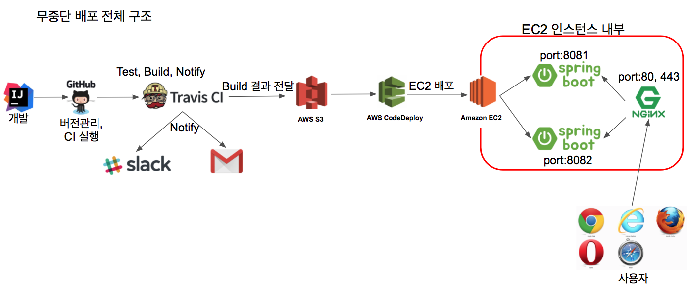

# 무중단 배포 📌

무중단 배포에는 몇가지 방식이 있지만 그중에서 Nginx를 이용하여 무중단 배포를 진행한다.

* AWS에서 블루 그린(Blue-Green) 무중단 배포
* 도커를 이용한 웹서비스 무중단 배포

## Nginx?
웹 서버, 리버스 프록시, 캐싱, 로드 밸런싱, 미디어 스트리밍 등을 위한 오픈소스 소프트웨어.

엔진엑스가 가진 여러 기능 중, 리버스 프록시라는 기능이 있다.

리버스 프록시는 엔진엑스가 외부의 요청을 받아 백엔드 서버로 요청을 전달하는 행위를 이야기한다.
리버스 프록시 서버(엔진엑스)는 요청을 전달하고, 실제 요청에 대한 처리는 뒷단의 웹 애플리케이션 서버들이 처리한다.

## Nginx 무중단 배포 
구조는 하나의 EC2 혹은 리눅스 서버에 엔진엑스 1대와 스프링 부트 Jar를 2대 사용하는것.

* 엔진엑스는 80(http), 443(https) 포트를 할당
* 스프링 부트1은 8081포트로 실행
* 스프링 부트2는 8082포트로 실행

    ###운영과정
1. 사용자는 서비스 주소로 접속(80 혹은 443 포트)
2. 엔진엑스는 사용자의 요청을 받아 현재 연결된 스프링 부트로 요청을 전달
   스프링 부트1 즉, 8081 포트로 요청을 전달한다고 가정.
3. 스프링 부트2는 엔진엑스와 연결된 상태가 아니므로 요청받지 못한다.

**1.1버전으로 신규 배포가 필요하다면?**  
엔진엑스와 연결되지 않은 스프링 부트2(8080포트)로 배포한다.

1. 배포하는 동안에는 서비스는 중단되지 않는다. 엔진엑스는 스프링 부트1을 바라보기 때문.
2. 배포가 끝나고 정상적으로 스프링부트2가 구동 중인지 확인.
3. 스프링 부트2가 정상 구동 중이면 nginx reload 명령어를 통해 8081대신에 8082를 바라보게 한다.
4. nginx reload는 0.1초 이내에 완료된다.

**이후 1.2버전 배포가 필요하면 이번에는 스프링 부트1로 배포한다**
1. 현재는 엔진엑스와 연결된 것이 스프링 부트2
2. 스프링 부트1의 배포가 끝났다면 엔진엑스가 스프링 부트1을 바라보도록 변경하고 nginx reload를 실행한다.
3. 이후 요청부터는 엔진엑스가 스프링 부트1로 요청을 전달한다.


https://jojoldu.tistory.com/267

## 엔진엑스 설치와 스프링 부트 연동
* EC2에 엔진엑스 설치
* 보안그룹 추가  
엔진엑스의 기본포트는 80. 해당 포트 번호가 보안 그룹에 없으니 보안그룹에 추가.
* 리다이렉션 주소 추가  
8080이 아닌 80포트로 주소가 변경되니 구글과 네이버 로그인에도 변경된 주소를 등록해야 한다.
* 엔진엑스와 스프링 부트 연동  
엔진엑스가 현재 실행 중인 스프링 부트 프로젝트를 바라볼 수 있도록 프록시 설정을 한다.
엔진엑스 설정 파일을 열어 다음의 내용을 추가
  
```conf
proxy_pass http://localhost:8080; // 엔진엑스로 요청이 오면 해당 주소로 전달
proxy_set_header X-Real-IP $remote_addr;
proxy_set_header X-Forwarded-For $proxy_add_x_forwarded_for;
proxy_set_header Host $http_host;

```

proxy_set_header XXX  
실제 요청 데이터를 header의 각 항목에 할당한다.  

     proxy_set_header X-Real-IP $remote_addr; -> Request Header의 X-Real-IP에 요청자의 IP를 저장.
     
## 무중단 배포 스크립트 만들기
### profile API추가
이후 배포시에 8081을 쓸지, 8082를 쓸지 판단하는 기준이 된다.

```java
@RequiredArgsConstructor
@RestController
public class ProfileController {
    private final Environment env;

    @GetMapping("/profile")
    public String profile() {
        List<String> profiles = Arrays.asList(env.getActiveProfiles()); //현재 실행 중인 ActiveProfile을 모두 가져온다
        List<String> realProfiles = Arrays.asList("real", "real1", "real2");
        String defaultProfile = profiles.isEmpty()? "default" : profiles.get(0);

        return profiles.stream()
                .filter(realProfiles::contains)
                .findAny()
                .orElse(defaultProfile); 
        //real, real1, real2는 모두 배포에서 사용될 profile이라 이 중 하나라도 있으면 그 값을 반환하도록 한다.
        
        
    }
}
```

해당 코드가 잘 동작하는지 확인하기 위한 테스트 코드  
Environment를 생성자 주입 받았기 때문에 스프링 테스트 없이 테스트 할수 있다.
```java
public class ProfileControllerUnitTest {

    @Test
    public void real_profile이_조회된다() {
        //given
        String expectedProfile = "real";
        MockEnvironment env = new MockEnvironment();
        env.addActiveProfile(expectedProfile);
        env.addActiveProfile("oauth");
        env.addActiveProfile("real-db");

        ProfileController controller = new ProfileController(env);

        //when
        String profile = controller.profile();

        //then
        assertThat(profile).isEqualTo(expectedProfile);
    }

    @Test
    public void real_profile이_없으면_첫번째가_조회된다() {
        //given
        String expectedProfile = "oauth";
        MockEnvironment env = new MockEnvironment();

        env.addActiveProfile(expectedProfile);
        env.addActiveProfile("real-db");

        ProfileController controller = new ProfileController(env);

        //when
        String profile = controller.profile();

        //then
        assertThat(profile).isEqualTo(expectedProfile);
    }

    @Test
    public void active_profile이_없으면_default가_조회된다() {
        //given
        String expectedProfile = "default";
        MockEnvironment env = new MockEnvironment();
        ProfileController controller = new ProfileController(env);

        //when
        String profile = controller.profile();

        //then
        assertThat(profile).isEqualTo(expectedProfile);
    }
}
```

/profile이 인증 없이도 호출될수 있게 SecurityConfig 클래스에 제외 코드를 추가한다.
```java
antMatchers("/", "/css/**", "/images/**", "/js/**", "/h2-console/**", "/profile").permitAll()

```        

SecurityConfig 설정이 잘 되었는지도 테스트 코드로 검증한다.
이 검증은 스프링 시큐리티 설정을 불러와야 하니 @SpringBootTest붙임

```java
@RunWith(SpringRunner.class)
@SpringBootTest(webEnvironment = SpringBootTest.WebEnvironment.RANDOM_PORT)
public class ProfileControllerTest {

    @LocalServerPort
    private int port;

    @Autowired
    private TestRestTemplate restTemplate;

    @Test
    public void profile은_인증없이_호출된다() throws Exception {
        String expected = "default";

        ResponseEntity<String> response = restTemplate.getForEntity("/profile", String.class);
        assertThat(response.getStatusCode()).isEqualTo(HttpStatus.OK);
        assertThat(response.getBody()).isEqualTo(expected);
    }
}

```

### real1, real2 profile 생성
현재 EC2환경에서 실횅되는 profile은 real밖에 없다. 해당 profile은 Travis CI 배포 자동화를 위한
profile이기 때문에 무중단 배포를 위한 profile 2개를 /src/main/resources 아래에 추가한다.

application-real1.properties
```properties
server.port=8081
spring.profiles.include=oauth,real-db
spring.jpa.properties.hibernate.dialect=org.hibernate.dialect.MySQL5InnoDBDialect
spring.session.store-type=jdbc

```

application-real2.properties
```properties
server.port=8082
spring.profiles.include=oauth,real-db
spring.jpa.properties.hibernate.dialect=org.hibernate.dialect.MySQL5InnoDBDialect
spring.session.store-type=jdbc

```

2개의 profile은 real profile과 크게 다른 점은 없지만, server.port가 8080이 아닌 8081/8082로 되어 있다.

### 엔진엑스 설정 수정
무중단 배포의 핵심은 엔진엑스 설정.
배포 때마다 엔진엑스의 프록시 설정(스프링 부트로 요청을 흘려보내는)이 순식간에 교체된다.

* /etc/nginx/conf.d/service-url.inc라는 파일 하나 생성해 다음 코드 입력
```
set $service_url http://127.0.0.1:8080;
```
* nginx.conf 파일을 찾아 다음 코드로 변경
```
include /etc/nginx/conf.d/sevice-url.inc;
proxy_pass $service_url;
```

### 배포 스크립트들 작성(생략)
* stop.sh : 기존 엔진엑스에 연결되어 있진 않지만, 실행 중이던 스프링 부트 종료
* start.sh : 배포할 신규 버전 스프링 부트 프로젝트를 stop.sh로 종료한 'profile'로 실행
* health.sh : 'start.sh'로 실행시킨 프로젝트가 정상적으로 실행됐는지 체크
* switch.sh : 엔진엑스가 바라보는 스프링 부트를 최신 버전으로 변경
* profile.sh : 앞선 4개의 스크립트 파일에서 공용으로 사용할 'profile'과 포트 체크 로직
